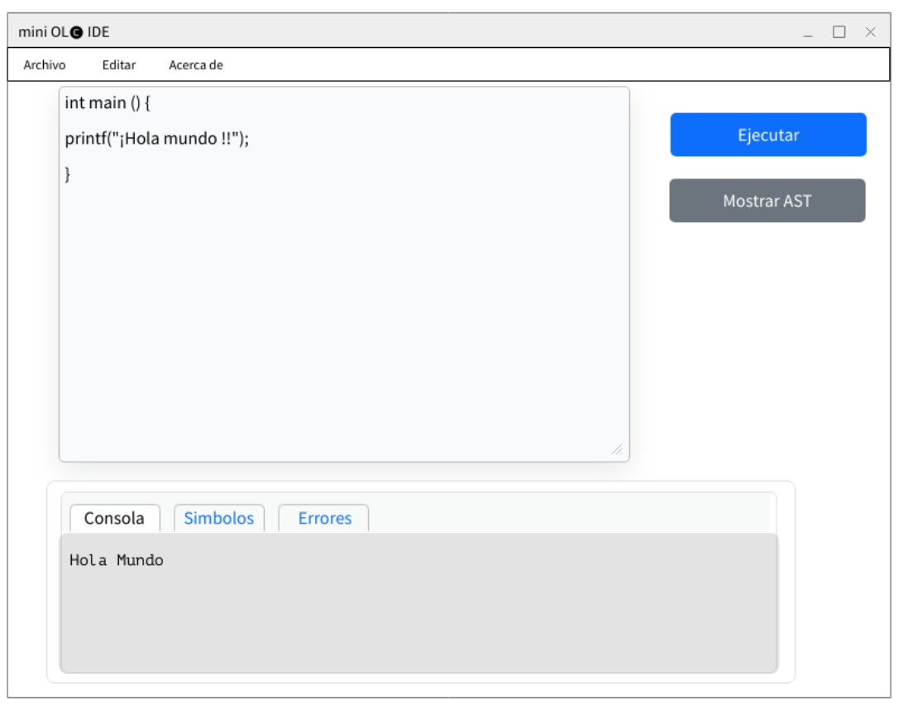
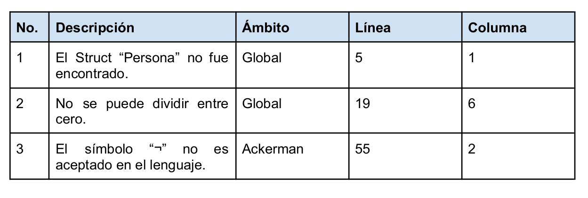
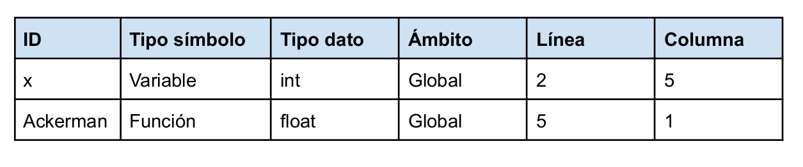
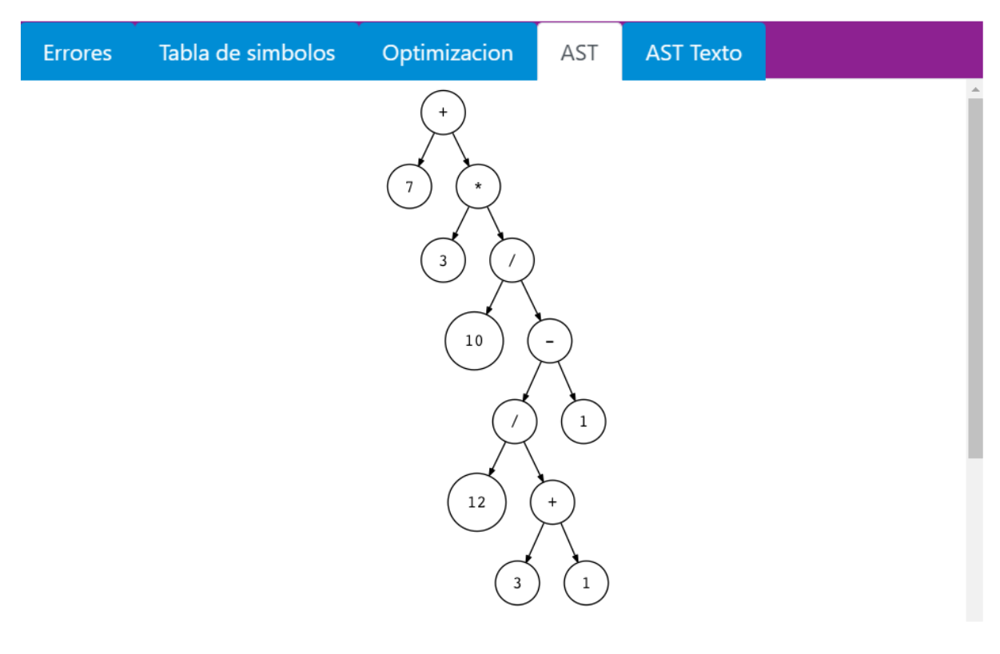

### Universidad de San Carlos de Guatemala
### Facultad de Ingenieria
### Arquitectura de Computadoras y Ensambladores 1 - "A"
### Catedratico: 
### Auxiliar: 
    

 Proyecto 1  
Manual de usuario 

    

| Nombre Completo                     | Carnet    
| :---:                               |  :----: 
| Luis Antonio Cutzal Chalí           | 201700841

  

---
  

### Descripcion general de la solución:
 

De acuerdo con el enunciado del Proyecto 1 del curso de Organización de Lenguajes y Compiladores 2 se desarrollo la aplicación con un enfoque en el análisis estadístico pero sin perder una clara influencia por uno de los lenguajes más mediáticos, influyentes e importantes de las ciencias computaciones como lo es C. El motivo de su creación es poder brindar una sintaxis clásica al programador pero con funciones para análisis y manejo de
datos.
  
mini OL🅒 IDE es un entorno de desarrollo que provee las herramientas para la escritura de
programas en lenguaje mini OL🅒. Este IDE nos da la posibilidad de visualizar tanto la
salida en consola de la ejecución del archivo fuente como los diversos reportes de la
aplicación que se explican más adelante. La interfaz y el framework para el desarrollo de
GUI queda a elección por parte del estudiante, siempre y cuando se utilice el lenguaje
indicado por los tutores.

  
Características Básicas   
1. 
Abrir, guardar y guardar como

2. 
Editor de código

3. 
Botón para ejecutar archivo

4. 
Reporte de errores

5. 
Reporte de tabla de símbolos

6. 
Reporte de AST

7. 
Consola de salida

  

Requerimientos minimos del sistema 
  
  
1. 
Tener un sistema operativo Windows 10 o superior, o cualquier version de Linux o Mac

2. 
Tener como minimo 4GB de memoria RAM

3. 
Tener instalado Graphiz para los reportes

4. 
Tener el compilador de C/C++ instalado

  

Uso del sistema
 
Pantalla principal
 

  

La función principal del editor será el ingreso del codigo fuente el cual será análizado. En este se podra abrir diversos archivos.

 
 
Reporte de errores   

El intérprete deberá ser capaz de detectar todos los errores que se encuentren durante el proceso de compilación. Todos los errores se deberán de recolectar y se mostrará un reporte de errores en el que, como mínimo, debe mostrarse el tipo de error, su ubicación y una breve descripción de por qué se produjo.

 

Tabla de Simbolos  

Este reporte mostrará la tabla de símbolos después de la ejecución del archivo. Se deberán de mostrar todas las variables, funciones y procedimientos que fueron declarados, así como su tipo y toda la información que el estudiante considere necesaria para demostrar que el intérprete ejecutó correctamente el código de entrada.

Reporte AST   
 

 

Este reporte mostrará el árbol de análisis sintáctico que se produjo al analizar el archivo de
entrada. Este debe de representarse como un grafo, se recomienda utilizar Graphviz para la
implementación de dicho árbol. El Estudiante deberá mostrar los nodos que considere
necesarios y se realizarán preguntas al momento de la calificación para que explique su
funcionamiento.

